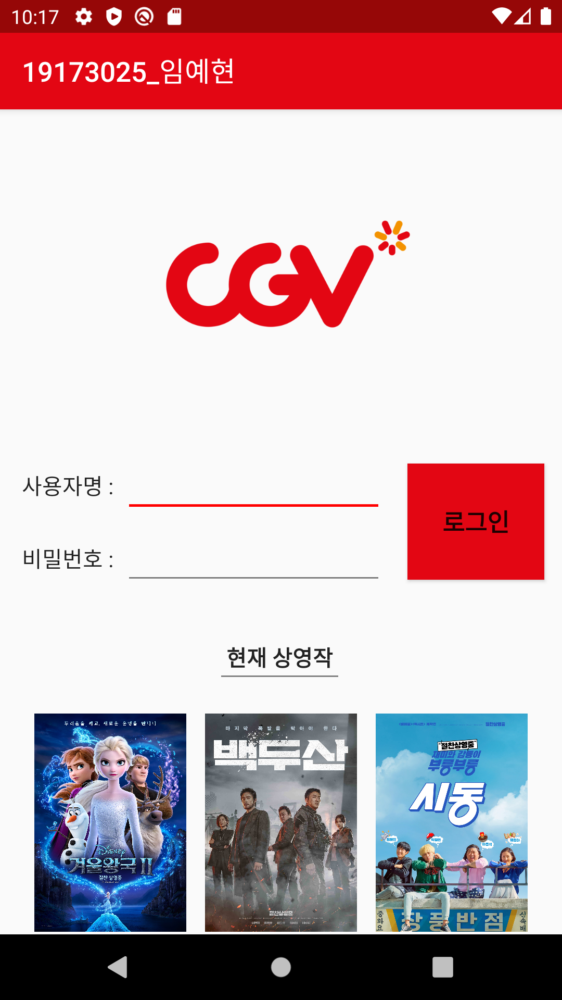
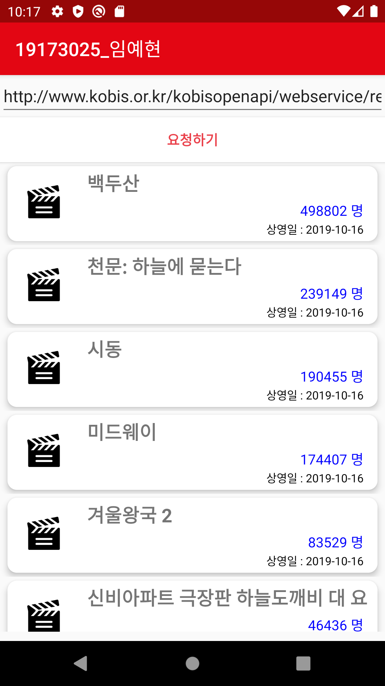

#기말과제

#프로젝트 구현방법
- 실제 영화 예매 정보 사이트처럼 로고를 배치하였고, 로그인 화면도 띄웠습니다.
- 현재 상영중인 영화도 로그인하기 전에 볼 수 있게 이미지를 넣었습니다.
- 로고 색깔에 맞게 상단바와 상태바, 버튼색 등 테마를 맞췄습니다.
- 영화를 고르기 수월하게 누적 관객 수를 띄웠고 오늘 날짜를 확인할 수 있게 상영일도 같이 배치했습니다.
- 이 앱을 통해 현재 개봉 중인 영화를 한 눈에 볼 수 있습니다.

</img>
</img>
